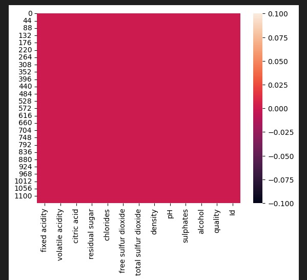
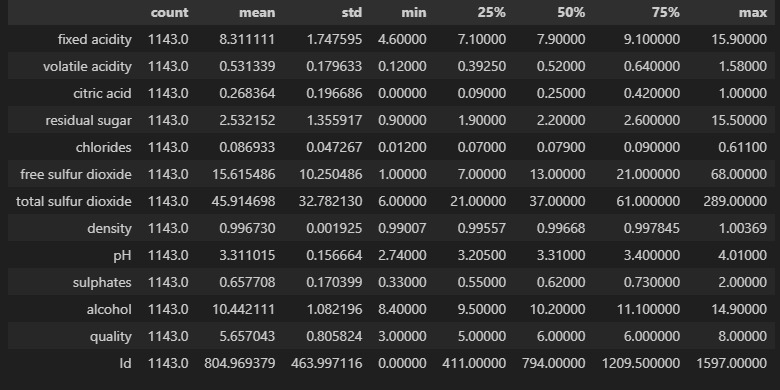
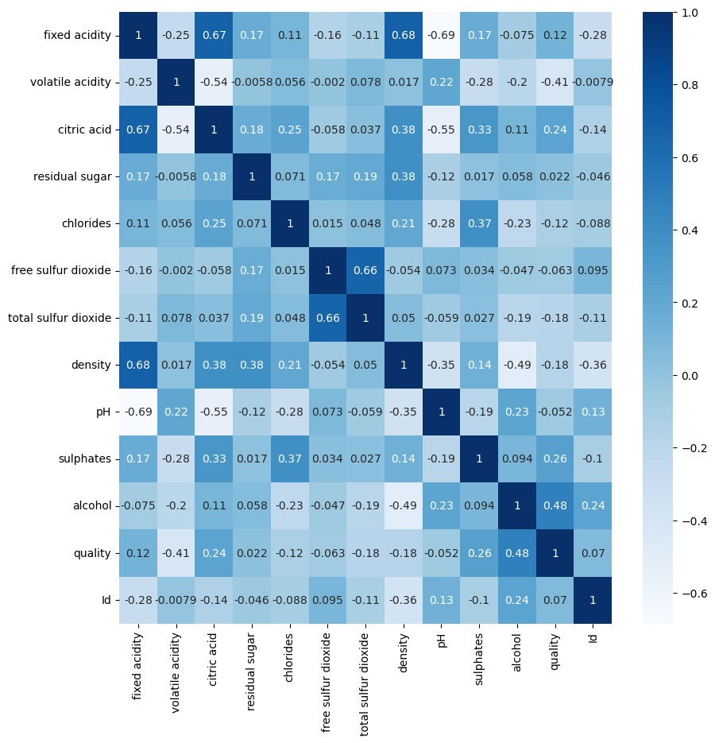
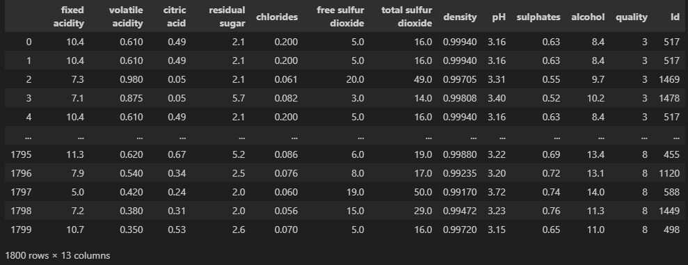
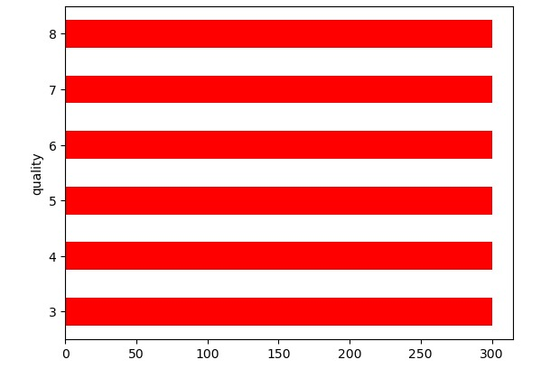
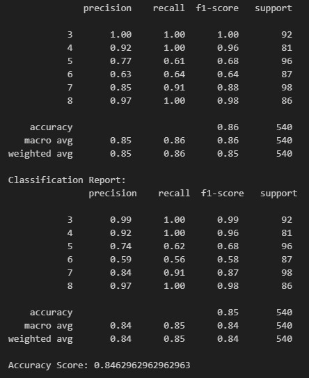
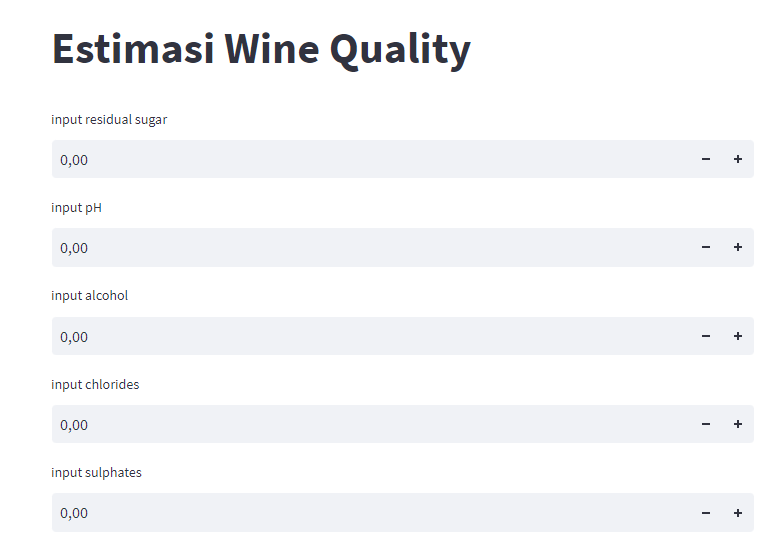
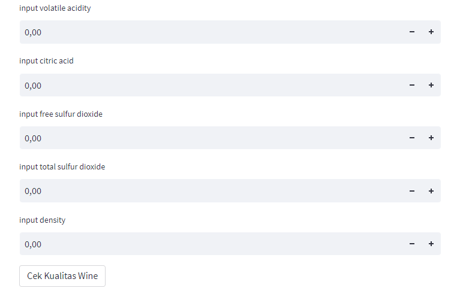

### Laporan Machine Learning
# NAMA : Nurul Hadi
# NIM : 211351109
# KELAS : IF MALAM A

### Domain Proyek

Proyek ini bertujuan untuk menganalisis komponen kimia yang ada dalam wine untuk menentukan kualitas dan karakteristiknya.Hasil analisis ini membantu produsen wine dalam mengendalikan proses produksi, mengoptimalkan formulasi wine, dan memastikan bahwa wine memenuhi standar kualitas yang diinginkan.

### Business Understanding

Untuk memastikan bahwa wine diproduksi sesuai dengan standar kualitas yang diinginkan oleh produsen atau pasar. Hasil analisis ini dapat digunakan untuk membuat perbaikan dalam proses produksi, memutuskan harga jual, atau memenuhi regulasi kualitas yang berlaku. Wine yang berkualitas tinggi sering kali memiliki karakteristik yang kompleks, seimbang, dan konsisten, dan proses analisis kualitas membantu mencapai standar ini.

## Problem Statements

Kualitas wine sangat dipengaruhi oleh komponen kimia yang ada di dalamnya. Oleh karena itu, penelitian ini bertujuan untuk mengidentifikasi dan menganalisis komponen kimia yang memiliki dampak signifikan terhadap kualitas wine. Masalah ini mencakup pertanyaan kunci, seperti:

- Bagaimana komponen kimia seperti kandungan alkohol, asam, gula, senyawa fenolik, asam amino, senyawa aroma, sulfur dioksida, dan lainnya mempengaruhi rasa, aroma, warna,tekstur dan kualitas wine?

## Goals

Tujuan dari proyek ini adalah untuk mengidentifikasi,memahami dan mengukur komponen-komponen kimia yang ada dalam wine sehingga dapat memenuhi standar kualitas yang dihasilkan.

- Penentuan Kualitas Wine: Membantu dalam menentukan apakah wine tersebut memenuhi standar kualitas yang diinginkan. Ini mencakup penilaian terhadap karakteristik organoleptik, seperti aroma dan rasa, serta faktor-faktor lain yang memengaruhi kualitas wine.

## Solution Statements

Solusi untuk proyek "Wine Quality Dataset" ini adalah mengembangkan model prediksi yang dapat memprediksi kualitas wine berdasarkan atribut-atribut kimia yang ada dalam dataset. Solusi ini akan memberikan manfaat sebagai berikut:

1.Prediksi Kualitas Wine: Dengan menggunakan model prediksi yang akurat, kita dapat memberikan prediksi kualitas wine berdasarkan komponen kimia yang ada dalam wine. Ini akan membantu produsen dan pengevaluasi wine untuk dengan cepat menilai kualitas wine tanpa perlu melakukan uji organoleptik yang mahal.

2.Konsistensi Kualitas: Dengan pemantauan komponen kimia, produsen dapat memastikan konsistensi kualitas wine mereka dari waktu ke waktu. Hal ini akan membantu dalam mempertahankan reputasi dan kepuasan pelanggan.

3.Model yang dihasilkan menggunakan Regresi Linier

### Data Understanding

Tahap ini memberikan fondasi analitik untuk sebuah penelitian dengan membuat ringkasan dalam data. Dari data yang telah diambil mengenai kualitas wine, terdapat 13 kolom yang berisi 11 kolom float64 dan 2 kolom int64. Disini saya menggunakan Regressi Linier 

(https://www.kaggle.com/code/pavithrasivan98/wine-quality-prediction)
## Variabel-variabel pada wine quality adalah sebagai berikut :

-fixed acidity         :   float64<br>
-volatile acidity      :   float64<br>
-citric acid           :   float64<br>
-residual sugar        :   float64<br>
-chlorides             :   float64<br>
-free sulfur dioxide   :   float64<br>
-total sulfur dioxide  :   float64<br>
-density               :   float64<br>
-pH                    :   float64<br>
-sulphates             :   float64<br>
-alcohol               :   float64<br>
-quality               :   int64  <br>
-Id                    :   int64 <br>

### Data Preparation
# Data Collection
Untuk data collection ini, saya mendapatkan dataset yang nantinya digunakan dari website kaggle dengan nama dataset Wine Quality Dataset, jika anda tertarik dengan datasetnya, anda bisa click link diatas.

# Data Discovery & Profiling

Import Libraries: Pustaka-pustaka yang diperlukan diimpor, seperti Pandas (untuk manipulasi data), NumPy (untuk operasi numerik), Matplotlib (untuk visualisasi), Seaborn (untuk visualisasi data statistik), dan beberapa modul dari Scikit-Learn (untuk pemodelan dan evaluasi).

```
import pandas as pd
import numpy as np
import matplotlib.pyplot as plt
import seaborn as sns
from sklearn.preprocessing import StandardScaler
from sklearn.ensemble import RandomForestClassifier

```

Load Data: Data dalam file "WineQT.csv" dibaca menggunakan Pandas dan disimpan dalam DataFrame dengan nama "df."

```
df = pd.read_csv("WineQT.csv")

```

Data Exploration:

```
-df.head()
<br> 
```
```
-df.info()
<br> 
```
```
-sns.heatmap(df.isnull())
<br> 
```
```
-df.describe().T
<br> 
```

Visualisasi Data:

Membuat peta panas (heatmap) untuk menggambarkan korelasi antara fitur-fitur data.
train dan test adalah data yang dibagi menjadi data pelatihan dan pengujian.
Menunjukkan ukuran data pelatihan dan pengujian dengan train.shape dan test.shape.
Menampilkan distribusi kelas "quality" dalam data pelatihan.

```
plt.figure(figsize=(10,10))
sns.heatmap(df.corr(),annot=True,cmap="Blues")
<br> 
```
Split Data :

Melakukan split data untuk memangkas beberapa data yang dipakai.

```
train,test = train_test_split(df,test_size=0.2,random_state=0,shuffle = True)

```
Selanjutnya kode train.shape digunakan untuk perintah yang digunakan untuk mengambil dimensi atau ukuran dari Data.

```
train.shape

```

Lalu gunakan perintah test.shape untuk memeriksa bentuk (shape) dari Data.

```
test.shape
```

Lalu,saya menghitung jumlah kemunculan setiap nilai dalam kolom 'quality' dari Data.

```
train['quality'].value_counts()
```

Penanganan Ketidakseimbangan Kelas:

Melakukan oversampling pada kelas minoritas (quality 3, 4, 7, dan 8) dan undersampling pada kelas mayoritas (quality 5 dan 6).
```
df3 = train[train['quality'] == 3] #Minority
df4 = train[train['quality'] == 4] #Minority
df5 = train[train['quality'] == 5] #Majority
df6 = train[train['quality'] == 6] #Majority
df7 = train[train['quality'] == 7] #Minority
df8 = train[train['quality'] == 8] #Minority
```

Gunakan fungsi resample dari modul sklearn.utils untuk menangani ketidakseimbangan kelas dalam dataset. 

```
from sklearn.utils import resample

df3_up = resample(df3, replace = True, n_samples = 300, random_state = 12)
df4_up = resample(df4, replace = True, n_samples = 300, random_state = 12)
df7_up = resample(df7, replace = True, n_samples = 300, random_state = 12)
df8_up = resample(df8, replace = True, n_samples = 300, random_state = 12)

```
Kode program ini digunakan untuk melakukan undersampling pada dua kelas mayoritas dalam dataset.

```
df5_down = df5.sample(n=300).reset_index(drop=True)
df6_down = df6.sample(n=300).reset_index(drop=True)
```
Program ini bertujuan untuk menggabungkan beberapa DataFrames menjadi satu DataFrame tunggal.

```
df_balanced = pd.concat([df3_up,df4_up,df5_down,df6_down,df7_up,df8_up]).reset_index(drop=True)
```

Variabel ini adalah hasil dari penanganan ketidakseimbangan kelas dalam data pelatihan.

```
df_balanced
<br> 
```

Kode program ini digunakan untuk menghasilkan grafik batang horizontal (horizontal bar chart) yang menunjukkan distribusi kelas (nilai "quality") dalam DataFrame df_balanced.

```
df_balanced['quality'].value_counts().plot(kind='barh',color = 'red')
<br> 
```

Kode program berikut adalah bagian dari persiapan data dalam proses analisis atau pemodelan data. Dalam kode ini, variabel X dan y digunakan untuk memisahkan data menjadi fitur (X) dan label (y). Ini umumnya diperlukan ketika Anda ingin membangun model yang akan memprediksi label atau target berdasarkan fitur-fitur yang ada dalam data Anda.

```
X = df_balanced.drop('quality',axis=1)
y = df_balanced['quality']
```

# Modeling

Baris kode berikut melakukan pemisahan data menjadi empat subset: X_train, X_val, y_train, dan y_val menggunakan modul train_test_split dari pustaka Scikit-Learn. Ini adalah langkah umum dalam pembuatan model dan pengujian model pada data. 

```
X_train,X_val,y_train,y_val = train_test_split(X,y,test_size=0.3,random_state=1)
```

Kode program berikut adalah bagian dari persiapan data yang terkait dengan pemodelan. Program ini digunakan untuk memisahkan fitur (X_test) dan label/target (y_test) dari data pengujian (test set).

```
X_test = test.drop('quality',axis=1)
y_test = test['quality']
```


 Berikut ini adalah salah satu tahap yang umum dilakukan dalam analisis data dan pemodelan mesin untuk memastikan bahwa variabel-variabel dalam data memiliki nilai yang seragam dan dapat diolah dengan benar oleh model yang akan digunakan. 

 ```
 sc = StandardScaler()
X_train = sc.fit_transform(X_train)
X_test = sc.transform(X_test)
X_val = sc.transform(X_val)
 ```

 Model Pemilihan dan Pelatihan:

Menggunakan model RandomForestClassifier dari Scikit-Learn.
Melatih model menggunakan data pelatihan yang telah diproses.

```
rf = RandomForestClassifier()
rf.fit(X_train,y_train)
y_pred_rf = rf.predict(X_val)
print(classification_report(y_val,y_pred_rf))
<br> 
```
Hasil accuracy yang didapat lumayan juga,yaitu sebesar 0,87

Sekarang modelnya sudah selesai, export sebagai sav agar nanti bisa  digunakan pada project web streamlit.

```
import pickle
filename = 'Estimasi_Wine_Quality.sav'
pickle.dump(rf, open(filename, 'wb'))

```

## Evaluation
disini saya menggunakan classification_report dan accuracy_score untuk model RandomForestClassifier.

```
rf = RandomForestClassifier()
rf.fit(X_train,y_train)
y_pred_rf = rf.predict(X_val)
print(classification_report(y_val,y_pred_rf))
print("Classification Report:\n", classification_rep)
print("Accuracy Score:", accuracy)
```

### Deployment 
[app](https://tugasuts-a8hud7dkwdvtth2b5hvkpj.streamlit.app/)
<br> 
<br> 